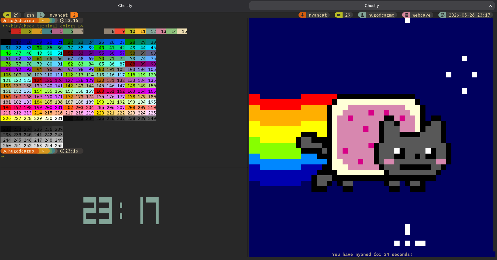

# dotfiles

My personal dotfiles


# What's inside

A short overview of each tool configured here — what it is and why it's part of the setup.

| Tool | What | Why |
| --- | --- | --- |
| **zsh** | An interactive shell, used here as the default login shell. | Richer scripting and completion than bash, with a large plugin ecosystem for a more productive command line. |
| **starship** | A cross-shell prompt. | A fast, informative prompt that surfaces context (git status, language versions, etc.) without slowing the shell down. |
| **tmux** | A terminal multiplexer. | Splits a single terminal into panes/windows and keeps sessions alive across disconnects — handy for long-running work and remote machines. |
| **ghostty** | A GPU-accelerated terminal emulator. | The terminal application itself: fast rendering and modern defaults with minimal configuration. |
| **atuin** | A shell history manager. | Replaces the default history with a searchable, SQLite-backed history that can sync across sessions and machines, making past commands easy to find. |
| **direnv** | An environment switcher. | Loads/unloads environment variables per directory, so project-specific settings apply only where they're needed. |
| **zoxide** | A smarter `cd`. | Jumps to frequently used directories by partial name, cutting down on long `cd` paths. |
| **neovim** | A modal text editor. | Primary code editor, configured with LSP, completion, and debugging for a lightweight IDE-like experience in the terminal. |
| **git** | Version control. | Tracks code history; the included `.gitconfig` sets personal defaults and aliases. |

# How to install

```sh
# copy
cp starship ~/.config
cp tmux ~/.config
cp zsh ~/.config
cp ghostty ~/.config

# create links
ln -sf ~/.config/zshrc ~/.zshrc
ln -sf ~/.config/profile ~/.profile
ln -sf ~/.config/tmux/tmux.conf ~/.tmux.conf
```

# Required dependencies

- [tmux](https://github.com/tmux/tmux/wiki)
- [zsh](https://www.zsh.org/)
- [atuin](https://atuin.sh/)
- [starship](https://github.com/starship/starship)
- [direnv](https://direnv.net/)
- [zoxide](https://github.com/ajeetdsouza/zoxide)
- [tpm](https://github.com/tmux-plugins/tpm)
- [zsh-autosuggestions](https://archlinux.org/packages/extra/any/zsh-autosuggestions/)
- [zsh-syntax-highlighting](https://archlinux.org/packages/extra/any/zsh-syntax-highlighting/)

# Inspirations

This project was inspired by ideas, patterns, and approaches from other open-source repositories and community work.

Special thanks to:

- [omerxx/dotfiles](https://github.com/omerxx/dotfiles) follow the author on his YouTube Channel [DevOps Toolbox](https://www.youtube.com/@devopstoolbox);
